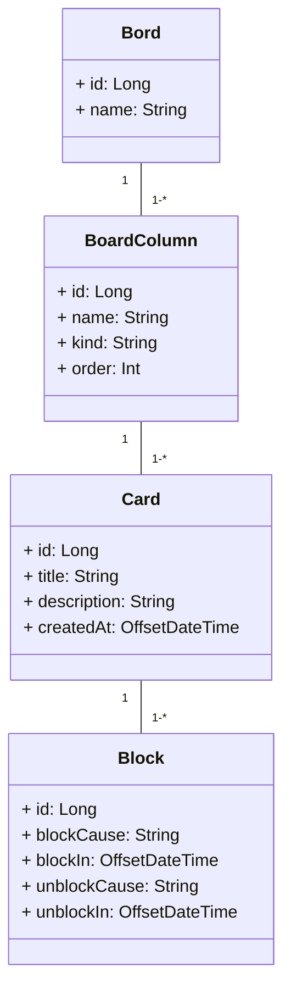

# DIO - JAVA

## DESAFIO - BOARD DE TAREFAS

Repositório criado durante lab "Criando seu Board de Tarefas com Java".
    
### DIAGRAMA DE CLASSE 

## Referência

 - [Board de Tarefas](https://github.com/digitalinnovationone/board)
  
